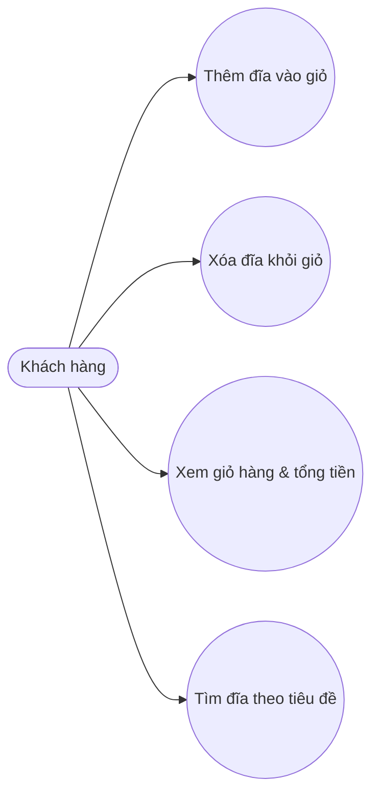

# AIMS-mini – Use case

```mermaid
flowchart LR
    KH([Khách hàng])
    KH --> UC1((Thêm đĩa vào giỏ))
    KH --> UC2((Xóa đĩa khỏi giỏ))
    KH --> UC3((Xem giỏ hàng & tổng tiền))
    KH --> UC4((Tìm đĩa theo tiêu đề))
```
